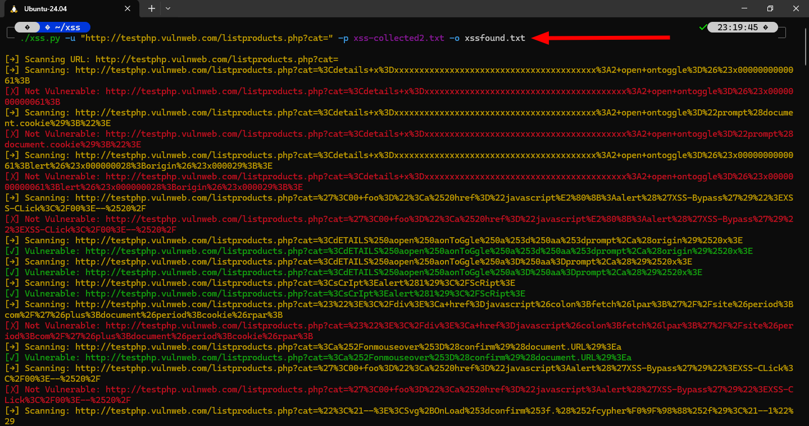
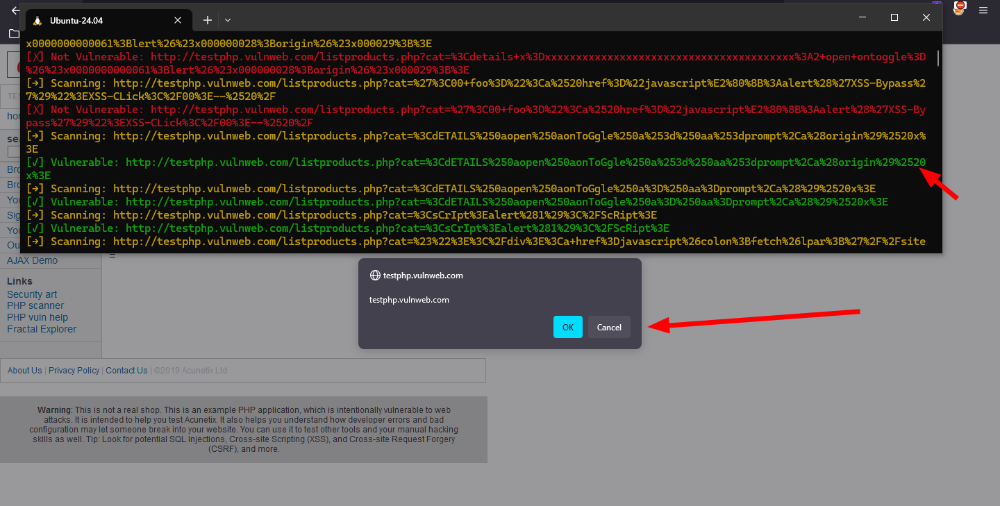
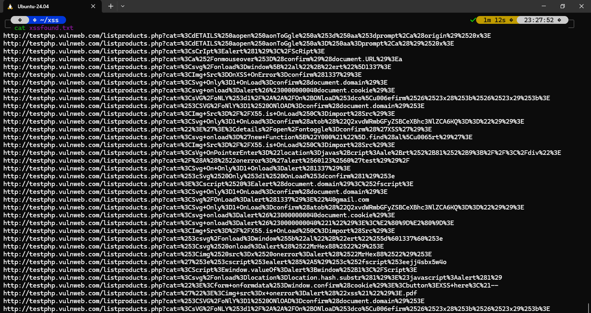

## XSS Scaning tool







## Usage

```
xss.py -u "http://testphp.vulnweb.com/listproducts.php?cat=" -p xss-collected2.txt -o xssfound.txt
```
## Options

```
xss.py -h                                                                                                                                           ─╯
usage: xss.py [-h] [-f FILE] [-u URL] -p PAYLOADS [-o OUTPUT]

XSS Scanner using requests library.

options:
  -h, --help            show this help message and exit
  -f FILE, --file FILE  Path to input file containing URLs.
  -u URL, --url URL     Scan a single URL.
  -p PAYLOADS, --payloads PAYLOADS
                        Path to payload file.
  -o OUTPUT, --output OUTPUT
                        Path to save vulnerable URLs.
```
